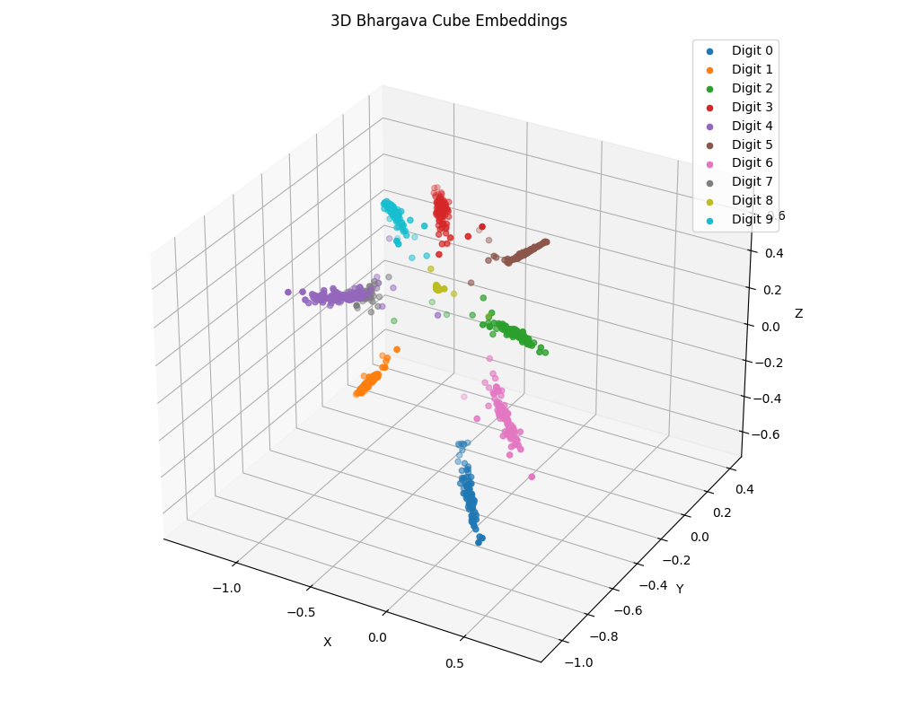

# BCMEM: Bhargava Cube-Inspired Quadratic Regularization for Structured Neural Embeddings

[]([https://icaa-conf.org/](https://icaa2026.framer.website/)) <!-- Link to the conference -->
[]([https://www.springer.com/series/558](https://link.springer.com/conference/icaa))
[](https://arxiv.org/abs/XXXX.XXXXX) <!-- Replace with your arXiv link -->
[](https://opensource.org/licenses/MIT)

This repository contains the official implementation for the paper "Bhargava Cube-Inspired Quadratic Regularization for Structured Neural Embeddings," accepted at the International Conference on Applied Algorithms (ICAA) 2026.

---

## 1. Abstract

We present a novel approach to neural representation learning that incorporates algebraic constraints inspired by Bhargava cubes from number theory. Traditional deep learning methods learn representations in unstructured latent spaces lacking interpretability and mathematical consistency. Our framework maps input data to a constrained 3-dimensional latent space where embeddings are regularized to satisfy learned quadratic relationships derived from Bhargava's combinatorial structures. The architecture employs a differentiable auxiliary loss function, guiding models toward mathematically structured representations. On MNIST, our method achieves **99.46% accuracy** while producing interpretable 3D embeddings that naturally cluster by class and satisfy the learned algebraic constraints.

## 2. The Core Contribution: Architectural Regularization from First Principles

This project was a formal inquiry into a fundamental hypothesis: that deep mathematical structures from abstract algebra can serve as a powerful new class of **inductive biases** for deep learning.

The core novelty is a **differentiable quadratic regularization loss** inspired by the Gauss composition laws on binary quadratic forms, as generalized by Manjul Bhargava's work on 2x2x2 integer cubes. This loss term acts as a structural regularizer, forcing the learned latent space to conform to these number-theoretic principles, thereby moving beyond purely geometric or statistical priors.


_**Figure 1:** 3D embeddings of MNIST test samples, demonstrating the emergence of a highly structured, class-separated manifold as a direct result of our algebraic regularization._

## 3. Key Results

-   **High Performance:** Achieves **99.46%** classification accuracy on the MNIST test set.
-   **Structured Latent Space:** Successfully learns a low-dimensional, interpretable manifold where classes are well-separated.
-   **Algebraic Consistency:** The learned embeddings satisfy the imposed quadratic constraints, proving the effectiveness of the auxiliary loss.

## 4. Citation

This work is published in the proceedings of ICAA 2026 (Springer, Lecture Notes in Computer Science).

```bibtex
@inproceedings{sairam2025bhargava,
author = {Sairam S, Prateek P Kulkarni},
title = {Bhargava Cube-Inspired Quadratic Regularization for Structured Neural Embeddings},
year = {2026},
isbn = {enter},
publisher = {Springer-Verlag},
doi = {doi},
booktitle = {Applied Algorithms: Third International Conference, ICAA 2026, Kolkata, India, January 7–9, 2026, Proceedings},
keywords = {Representation learning, Bhargava cubes, geometric regularization, dimensionality reduction, interpretable embeddings},
location = {Kolkata, India}
}
```
